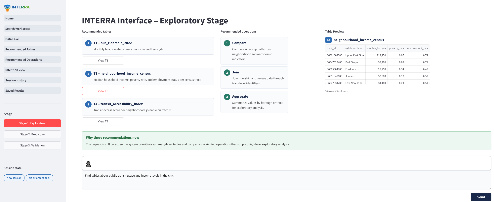
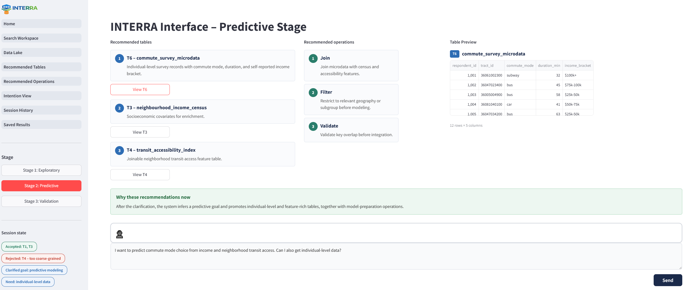
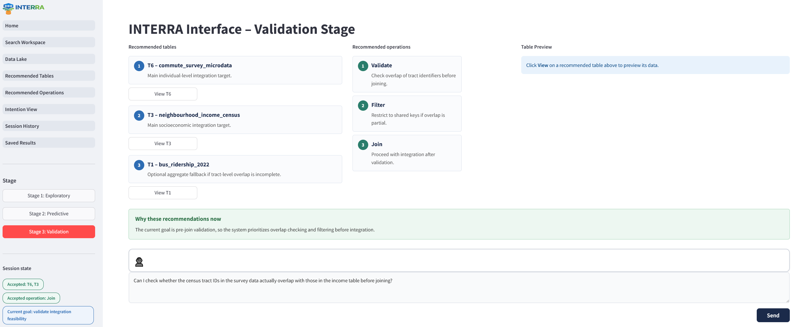

# INTERRA: Intent-Aware and Interactive Exploration and Recommendation for Table Search in Data Lakes


Prototype implementation and supplementary artifact for the **INTERRA: Intent-Aware and Interactive Exploration and Recommendation for Table Search in Data Lakes** paper.

## Overview

INTERRA is a framework for human-in-the-loop table search in data lakes that goes beyond static top-*k* relevance ranking. Rather than treating table retrieval as a one-shot search problem, INTERRA decomposes user input into **query**, **intention**, and **action** signals, which together steer a recommender that produces both **candidate tables** and **recommended next-step operations** (e.g., Join, Filter, Compare, Validate, Aggregate).

The key idea is that user intention is not a post-hoc interpretation of retrieved results, but an explicit control layer that guides recommendation within an iterative interaction loop. As the user inspects tables, provides feedback, and refines their goals, the system updates its inferred intention and adapts its recommendations accordingly.

## Architecture

The system integrates four components in a single interaction loop:

1. **Table Retrieval** — finds candidate tables from the data lake based on query signals.
2. **Intention Extraction** — infers the user's analytical goal from their input and interaction history.
3. **Action Extraction** — derives recommended next-step operations over the candidate tables.
4. **Recommendation** — uses intention and action signals to rank tables and operations for the user.

## Prototype

This repository contains a proof-of-concept implementation built with:

- **Frontend** — Streamlit: interactive UI with session-aware navigation, table preview, and recommendation display.
- **Backend** — FastAPI: serves sample data-lake tables via a REST API.
- **Docker Compose** — fully containerised for reproducible runs.

The prototype demonstrates a three-stage walkthrough scenario (exploratory, predictive, validation) from the paper, showing how recommendations evolve as the user's goal becomes clearer through interaction.

## Screenshots

### Stage 1: Exploratory


### Stage 2: Predictive


### Stage 3: Validation


## Requirements

- [Docker](https://docs.docker.com/get-docker/) + [Docker Compose](https://docs.docker.com/compose/)
- `make`

## Quick Start

```bash
cp .env.example .env
make up-build
```

The UI will be available at **http://localhost:8501**.

## Commands

| Command | Description |
|---|---|
| `make build` | Build all Docker images |
| `make start` | Start all services (detached) |
| `make up` | Start all services (detached) |
| `make up-build` | Rebuild images and start |
| `make stop` | Stop containers without removing them |
| `make down` | Stop and remove containers and networks |
| `make restart` | Restart all services |
| `make logs` | Tail logs for all services |
| `make logs-backend` | Tail backend logs only |
| `make logs-frontend` | Tail frontend logs only |
| `make shell-backend` | Shell into the backend container |
| `make shell-frontend` | Shell into the frontend container |
| `make clean` | Stop and remove containers, networks, and volumes |

## Services

| Service | URL |
|---|---|
| Streamlit UI | http://localhost:8501 |
| FastAPI Backend | http://localhost:8000 |
| API Docs (Swagger) | http://localhost:8000/docs |

## Project Structure

```
INTERRA/
├── docker-compose.yml
├── Makefile
├── .env.example
├── .gitignore
├── LICENSE
├── README.md
├── backend/
│   ├── Dockerfile
│   ├── requirements.txt
│   ├── main.py              # FastAPI app and table endpoints
│   └── data.py              # Sample data-lake tables (T1–T6)
├── frontend/
│   ├── Dockerfile
│   ├── requirements.txt
│   ├── app.py               # Streamlit UI (3-stage mockup viewer)
│   └── _interra_logo.png    # System logo
└── docs/
    └── prototype/
        ├── interra_1.PNG    # Screenshot: Exploratory stage
        ├── interra_2.PNG    # Screenshot: Predictive stage
        └── interra_3.PNG    # Screenshot: Validation stage
```

Both services mount their source directory as a volume, so code changes apply immediately without rebuilding.

## License

See [LICENSE](LICENSE) for details.

## Citation

If you use this artifact in your research, please cite the associated paper.
